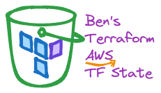

<br/>
<p align="center">
  <a href="https://github.com/bendoerr/terraform-aws-tfstate">
    <picture>
      <source media="(prefers-color-scheme: dark)" srcset="docs/logo-dark.png">
      
    </picture>
  </a>

<h3 align="center">Ben's Terraform AWS Terraform Remote State Module</h3>

  <p align="center">
    This is how I do it.
    <br/>
    <br/>
    <a href="https://github.com/bendoerr/terraform-aws-tfstate"><strong>Explore the docs »</strong></a>
    <br/>
    <br/>
    <a href="https://github.com/bendoerr/terraform-aws-tfstate/issues">Report Bug</a>
    .
    <a href="https://github.com/bendoerr/terraform-aws-tfstate/issues">Request Feature</a>
  </p>
</p>

 

## About The Project

My opinionated AWS Defaults module.

## Usage

```
module "context" {
  source    = "git@github.com:bendoerr/terraform-null-context?ref=v0.3.0"
  namespace = "brd"
  role      = "production'
  region    = "us-east-1"
  project   = "example'
}

module "tfstate" {
  source               = "git@github.com:bendoerr/terraform-aws-tfstate?ref=v0.1.0"
  context              = module.context.shared
}
```

## Requirements

| Name | Version |
|------|---------|
| <a name="requirement_terraform"></a> [terraform](#requirement\_terraform) | >= 0.13 |
| <a name="requirement_aws"></a> [aws](#requirement\_aws) | ~> 5.0 |

## Providers

| Name | Version |
|------|---------|
| <a name="provider_aws"></a> [aws](#provider\_aws) | ~> 5.0 |

## Modules

| Name | Source | Version |
|------|--------|---------|
| <a name="module_label_dynamodb_rw"></a> [label\_dynamodb\_rw](#module\_label\_dynamodb\_rw) | git@github.com:bendoerr/terraform-null-label | v0.3.0 |
| <a name="module_label_locks"></a> [label\_locks](#module\_label\_locks) | git@github.com:bendoerr/terraform-null-label | v0.3.0 |
| <a name="module_label_s3_rw"></a> [label\_s3\_rw](#module\_label\_s3\_rw) | git@github.com:bendoerr/terraform-null-label | v0.3.0 |
| <a name="module_label_store"></a> [label\_store](#module\_label\_store) | git@github.com:bendoerr/terraform-null-label | v0.3.0 |
| <a name="module_store"></a> [store](#module\_store) | terraform-aws-modules/s3-bucket/aws | 3.15.1 |

## Resources

| Name | Type |
|------|------|
| [aws_dynamodb_table.locks](https://registry.terraform.io/providers/hashicorp/aws/latest/docs/resources/dynamodb_table) | resource |
| [aws_iam_policy.s3_rw](https://registry.terraform.io/providers/hashicorp/aws/latest/docs/resources/iam_policy) | resource |
| [aws_iam_policy.state_dynamodb_rw](https://registry.terraform.io/providers/hashicorp/aws/latest/docs/resources/iam_policy) | resource |
| [aws_iam_policy_document.dynamodb_rw](https://registry.terraform.io/providers/hashicorp/aws/latest/docs/data-sources/iam_policy_document) | data source |
| [aws_iam_policy_document.s3_rw](https://registry.terraform.io/providers/hashicorp/aws/latest/docs/data-sources/iam_policy_document) | data source |
| [aws_kms_alias.s3](https://registry.terraform.io/providers/hashicorp/aws/latest/docs/data-sources/kms_alias) | data source |

## Inputs

| Name | Description | Type | Default | Required |
|------|-------------|------|---------|:--------:|
| <a name="input_context"></a> [context](#input\_context) | Shared Context from Ben's terraform-null-context | <pre>object({<br>    attributes     = list(string)<br>    dns_namespace  = string<br>    environment    = string<br>    instance       = string<br>    instance_short = string<br>    namespace      = string<br>    region         = string<br>    region_short   = string<br>    role           = string<br>    role_short     = string<br>    project        = string<br>    tags           = map(string)<br>  })</pre> | n/a | yes |

## Outputs

| Name | Description |
|------|-------------|
| <a name="output_iam_locks_rw_arn"></a> [iam\_locks\_rw\_arn](#output\_iam\_locks\_rw\_arn) | n/a |
| <a name="output_iam_locks_rw_id"></a> [iam\_locks\_rw\_id](#output\_iam\_locks\_rw\_id) | n/a |
| <a name="output_iam_tfstate_rw_arn"></a> [iam\_tfstate\_rw\_arn](#output\_iam\_tfstate\_rw\_arn) | n/a |
| <a name="output_iam_tfstate_rw_id"></a> [iam\_tfstate\_rw\_id](#output\_iam\_tfstate\_rw\_id) | n/a |
| <a name="output_lock_table_arn"></a> [lock\_table\_arn](#output\_lock\_table\_arn) | n/a |
| <a name="output_lock_table_id"></a> [lock\_table\_id](#output\_lock\_table\_id) | n/a |
| <a name="output_lock_table_name"></a> [lock\_table\_name](#output\_lock\_table\_name) | n/a |
| <a name="output_tfstate_arn"></a> [tfstate\_arn](#output\_tfstate\_arn) | n/a |
| <a name="output_tfstate_id"></a> [tfstate\_id](#output\_tfstate\_id) | n/a |


## Roadmap

See the [open issues](https://github.com/bendoerr/terraform-aws-tfstate/issues) for a list of proposed features (and known issues).

## Contributing

Contributions are what make the open source community such an amazing place to be learn, inspire, and create. Any contributions you make are **greatly appreciated**.
* If you have suggestions for adding or removing projects, feel free to [open an issue](https://github.com/bendoerr/terraform-aws-tfstate/issues/new) to discuss it, or directly create a pull request after you edit the *README.md* file with necessary changes.
* Please make sure you check your spelling and grammar.
* Create individual PR for each suggestion.

### Creating A Pull Request

1. Fork the Project
2. Create your Feature Branch (`git checkout -b feature/AmazingFeature`)
3. Commit your Changes (`git commit -m 'Add some AmazingFeature'`)
4. Push to the Branch (`git push origin feature/AmazingFeature`)
5. Open a Pull Request

## License

Distributed under the MIT License. See [LICENSE](https://github.com/bendoerr/terraform-aws-tfstate/blob/main/LICENSE.txt) for more information.

## Authors

* **Benjamin R. Doerr** - *Terraformer* - [Benjamin R. Doerr](https://github.com/bendoerr/) - *Built Ben's Terraform Modules*

## Acknowledgements

* [ShaanCoding (ReadME Generator)](https://github.com/ShaanCoding/ReadME-Generator)
